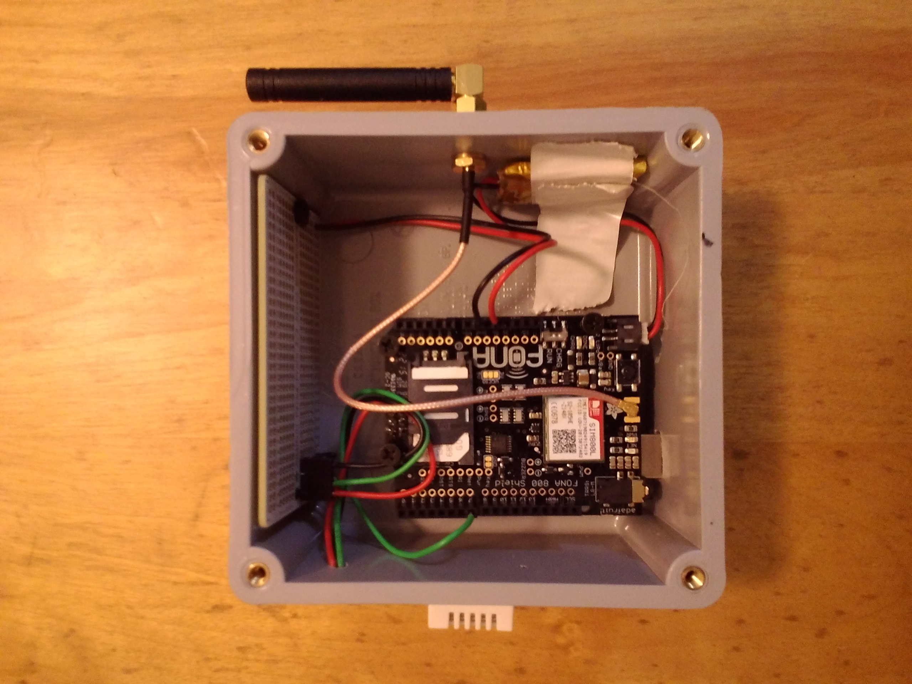

Remote temperature and humidity monitor circa 2015

Built on an Arduino UNO:
* SIM card shield
* DHT22 sensor
* Battery backup

Allowed any phone numbers on the `ALLOW_LIST` to ping the device
and be returned the current temperature and humidty via SMS

If the temperature fell below 5C or there was a sensor read issue
`ALERT_PHONE` would be sent an SMS. The device them slept for 24h.

Was placed in the crawl space of a vacation home and freezing or 
failure of the furnace would be known and someone local could check
it out (without being spammed SMS messages on their way).

Came in handy and alerted more than once over a period of a couple
years when the furnace exhaust pipe froze up. Improvements to cell 
data and mass market smart home thermostats eventually brought it's
replacement.

